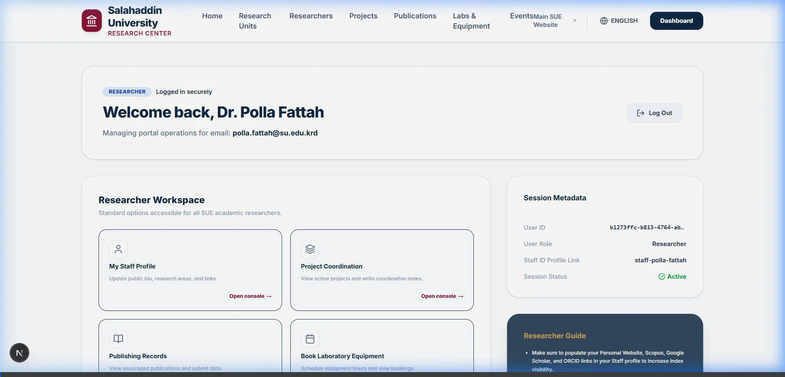
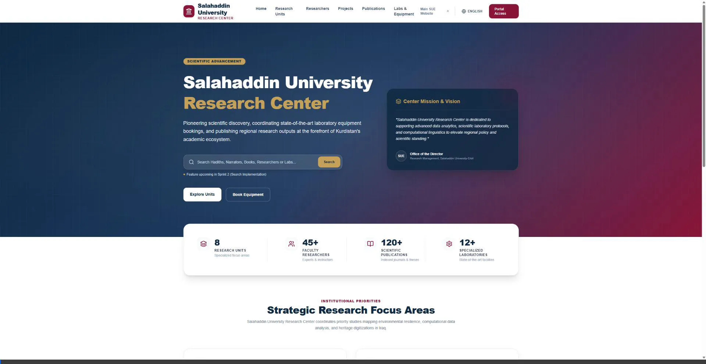

# SUE Research Center Portal - User Manual

This guide documents the usage workflows of the dynamic SUE Research Portal enhancements.

---

## 1. Content Drafting & Publishing Flow (CMS Portal)

Researchers can submit draft project and publication proposals directly from their dashboards.

### Researcher Submission
1. Log into the researcher workspace.
2. Under **Draft Content Submissions**, select either **Draft Publication Proposal** or **Draft Project Proposal**.
3. Fill out the proposal details and click **Submit Proposal Draft**. Your entry is saved in the database under `draft: true` status.

### Administrator Approval
1. Log into the administrative console.
2. In the **Superadmin System Console** under the **Content Moderation** card, locate the **Pending Approvals Queue**.
3. Review the proposed draft information, then click **Approve & Publish**. This converts the draft to a canonical record (`draft: false`), making it instantly live across public staff profiles and registry feeds.

#### 🎥 Video Tutorial: Proposing & Publishing Content

---

## 2. Laboratory Equipment Bookings & CSV Exporting

Supervisors can filter reservation logs and export lists.

### Moderation & Logging
1. Open the **Supervisor Control Panel** (Laboratory Bookings).
2. Filter through booking requests dynamically by typing submitter details in the live **Search** bar, or selecting specific units from the **Filter by Equipment** dropdown.
3. To export the full canonical reservation audit log, click **Export to CSV** at the top right to download a spreadsheet report.

#### 🎥 Video Tutorial: Navigation and Booking Controls

