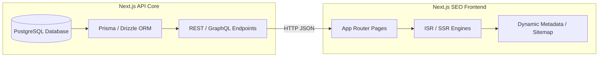

# SURC Website Migration: Requirements & Data Extraction Report

This report outlines the full requirements, data schemas, relational models, and layout mappings extracted from the **Salahaddin University Research Center (SURC)** Hugo-based website. It serves as a blueprint for migrating this project to **Next.js**.

All content pages (144 in total) have been parsed and compiled into a structured JSON file: [content_data.json](file:///C:/Users/polla/.gemini/antigravity-ide/brain/569dae50-6c7c-4669-b5d0-ac4af68dc411/content_data.json) for easy ingestion into your Next.js application.

---

## 1. Project Overview & Stats

*   **Source Platform:** Hugo (Extended v0.124.1+)
*   **Theme:** `bigspring-light-hugo` (customized to Salahaddin University Research Center branding)
*   **Custom Overrides:** Heavy overrides in styling, layouts (about, staff, labs, services), and custom logic (dynamic client-side filtering).
*   **Total Extracted Pages:** **144**
    *   **root (Main Pages):** 13 pages (Home, About, Contact, policy pages, etc.)
    *   **labs (Laboratories):** 37 pages
    *   **publications (Papers/Theses):** 20 pages
    *   **testimonials (Quotes):** 16 pages
    *   **staff (Researchers):** 12 pages
    *   **projects (Research Projects):** 9 pages
    *   **units (Research Units):** 8 pages
    *   **datasets (Open Data):** 5 pages
    *   **regulations (Guidelines):** 3 pages
    *   **templates (Application Forms):** 2 pages

### 1.1 Website Objectives & Target Audiences

#### Core Objectives:
*   **Academic Identity:** Establish the center's academic identity, research priorities, and accomplishments.
*   **Output Promotion:** Showcase active research projects, laboratory equipment, datasets, and publications.
*   **Operations Portal:** Advertise events, seminars, and download directories (forms/regulations).
*   **Dynamic Scheduling:** Facilitate equipment reservation workflows for students and staff.

#### Target Audiences:
*   **University researchers and academic staff** (managing profiles, collaborating, logging projects).
*   **Undergraduate and postgraduate students** (checking ethics regulations, scheduling lab equipment).
*   **External academic collaborators and international universities** (reviewing research outputs).
*   **Government institutions and industry partners** (exploring consultation and datasets).

---

## 2. Brand Design & Variables

The global site parameters are configured in [hugo.toml](file:///c:/Users/polla/Drives/PollaFattah/UNi/SUE/DAC/bigspring-light/hugo.toml) and overridden in [custom.scss](file:///c:/Users/polla/Drives/PollaFattah/UNi/SUE/DAC/bigspring-light/assets/scss/custom.scss). 

### Color Palette (SUE Visual Identity Alignment)
*   **Primary Maroon/Crimson:** `#C41E3A` (the official visual anchor for SUE and SURC)
*   **Secondary/Accent Gold:** `#D4AF37` / `#FFD700` (used in SUE branding emblem details)
*   **Academic Navy Blue/Slate:** `#0B2545` (matching the main university portal's high-contrast header sections)
*   **Neutral Backgrounds:** Light Grey `#F5F5F5`, Pure White `#FFFFFF`, and Dark Mode Slate `#1E262C`
*   **Accent Teal:** `.btn-teal` for secondary call-to-action buttons

### Typography & Multilingual Support
*   **English/Global Font:** `Lato` (Weights: 300, 400, 500, 600, 700) or clean modern sans-serifs like `Inter` / `Roboto`.
*   **Kurdish/Arabic Unicode Font Support:** Custom system-fallback stacks supporting Kurdish character sets (such as `Unikurd Web`, `Rabar`, or `Noto Sans Arabic`) to ensure clear rendering of Arabic-script low-resource languages on the main SUE portal.
*   **Right-to-Left (RTL) Layout Alignment:** When switching to Kurdish or Arabic:
    *   Use CSS logical properties (e.g., `margin-inline-start`, `text-align: start`, `flex-direction: row-reverse`) to flip the navigation bars, sidebars, forms, and grid directions automatically.
    *   Ensure buttons and input fields align with RTL text entry standards.
*   **Icons:** Font Awesome 6 Free (Solid, Regular, Brands)
*   **Logo Width:** `180px` (utilizing the official SUE circular emblem format)

### Main SUE Website (su.edu.krd) Look & Feel Guidelines
*   **High-Contrast Borders & Headers:** Use top borders and sub-navigation highlight bars in official Maroon/Crimson (`#C41E3A`) to match SUE's institutional portal look.
*   **Polished Shadows & Hover Lifts:** Apply a subtle box-shadow lift (`transform: translateY(-4px)`) and soft borders to layout cards (labs, publications, units) rather than harsh solid borders.
*   **multilingual Switcher UI:** Header must house a responsive language dropdown (EN/KU/AR) styled to match SUE's top-right language bar.
*   **Professional Academic Tone:** Emphasize clean, tabular layouts for equipment tables, spacious grid card padding, and professional data list components rather than informal marketing widgets.

### Global Navigation Configuration
The navigation and footer menus are defined in [menus.en.toml](file:///c:/Users/polla/Drives/PollaFattah/UNi/SUE/DAC/bigspring-light/config/_default/menus.en.toml):

*   **Main Header Menu:**
    *   Home (`/`)
    *   Events (`/events`)
    *   Projects (`/projects`)
    *   Publications (`/publications`)
    *   Units (`/units`)
    *   Labs (`/labs`)
*   **Footer Columns:**
    *   **Left Column (About):** About Us (`/about`), Research Units (`/units`), Projects (`/projects`), Publications (`/publications`)
    *   **Middle Column (Resources):** Labs (`/labs`), Events (`/events`), Staff & Researchers (`/staff`), Contact Us (`/contact`)
    *   **Right Column (Links):** Testimonials (`/testimonials`), Units (`/units`), University Website (`https://su.edu.krd`)

---

## 3. Section Data Schemas

Each content type is represented by a markdown file containing YAML frontmatter and markdown body content.

### A. Staff Schema (`content/staff/*.md`)
Represents researchers, board members, or staff.
```yaml
id: "staff-polla-fattah"                  # Unique identifier
title: "Dr. Polla Fattah"                 # Display name
subtitle: "Lecturer in Software Engineering"
image: "images/staff/polla.png"
unit: "unit-data-analysis"                # Links to a Unit ID
title_position: "Lecturer in Software Engineering"
email: "polla.fattah@su.edu.krd"
research_areas:
  - "Artificial Intelligence"
  - "Machine Learning"
  - "Data Mining"
related_projects: []                      # Custom linked project IDs
related_publications: []                  # Custom linked publication IDs
orcid: "https://orcid.org/0000-0002-XXXX-XXXX"
google_scholar: "https://scholar.google.com/citations?user=XXXXXX"
scopus: "https://www.scopus.com/authid/detail.uri?authorId=XXXXXX"
researchgate: "https://www.researchgate.net/profile/XXXXXX"
personal_website: "https://polla.dev"
bio: "Dr Polla Fattah is a lecturer..."   # Short description
draft: false
```
*Note:* The single page layout [single.html](file:///c:/Users/polla/Drives/PollaFattah/UNi/SUE/DAC/bigspring-light/layouts/staff/single.html) uses frontmatter fields to populate a sidebar, and renders `.Content` as the main body.

### B. Research Unit Schema (`content/units/*.md`)
Represents specialized units.
```yaml
id: "unit-data-analysis"
title: "Data Analysis Unit"
name: "Data Analysis Unit"
image: "images/unit-data-analysis.jpg"
description: "Advanced data analytics, statistical modeling, and computational research methods."
draft: false
```
*Note:* Details page renders layout [single.html](file:///c:/Users/polla/Drives/PollaFattah/UNi/SUE/DAC/bigspring-light/layouts/units/single.html).

### C. Projects Schema (`content/projects/*.md`)
Represents ongoing or completed projects.
```yaml
id: "project-data-platform"
title: "Data Analytics Platform Development"
name: "Data Analytics Platform Development"
description: "Development of an advanced data analytics platform..."
image: "images/projects/data-platform.jpg"
status: "ongoing"                         # "ongoing" | "completed"
unit: "unit-data-analysis"                # Links to Unit ID
year: "2024"
type: "Development Project"
related_publications:                     # Linked publication IDs
  - "pub-002"
related_staff:                            # Linked staff IDs
  - "staff-polla-fattah"
draft: false
```

### D. Publications Schema (`content/publications/*.md`)
Represents papers, conference articles, MSc/PhD theses, or reports.
```yaml
id: "pub-012"
title: "Multi‑Factor Classification Using Deep Learning for X‑ray Images"
type: "article"                           # "article" | "thesis" | "report"
degree: "PhD"                             # optional degree type for theses
authors:
  - staff: "staff-polla-fattah"           # List of staff IDs
year: "2024"
unit: "unit-data-analysis"                # Links to Unit ID
pdf: "/pdfs/multi-factor-xray-classification.pdf"
description: "This journal article proposes a deep-learning model..."
draft: false
```

### E. Labs Schema (`content/labs/<slug>/index.md`)
Represents research laboratories and equipment inventories.
```yaml
id: "agriculture-engineering-sciences-fish-resources-lab-33"
title: "Agriculture Engineering Sciences – Fish Resources – Lab 33"
short_name: "Lab 33"
location: "agriculture-engineering-sciences"
location_name: "Agriculture Engineering Sciences"
department: "fish-resources"
department_name: "Fish Resources"
category: "fish-resources"
category_name: "Fish Resources"
description: "Laboratory equipped for teaching and experimental activities."
image: "images/labs/agriculture-engineering-sciences-fish-resources-lab-33.jpg"
contact: "agriculture-engineering-sciences-fish-resources-lab-33@su.edu.krd"
capacity: "N/A"
status: "active"                          # "active" | "inactive"
equipment:                                # Equipment list
  - name: "Haematology Analyser"
    id: "eq-agriculture-engineering-sciences-fish-resources-lab-33-001"
    category: "fish-resources"
    description: "Haematology Analyser"
    status: "available"                   # "available" | "in-use" | "maintenance"
    working_units: 1
    out_of_order: 0
    total_units: 1
slug: "agriculture-engineering-sciences-fish-resources-lab-33"
layout: "lab"
type: "labs"
draft: false
```

### F. Datasets Schema (`content/datasets/*.md`)
Represents open-access research data.
```yaml
id: "dataset-climate-data"
title: "Climate Data Collection 2023-2024"
description: "Comprehensive climate data..."
unit: "unit-environmental-studies"
year: "2024"
access: "Open"                            # "Open" | "Restricted" | "On-Request"
format: "CSV, Excel"
size: "15 MB"
related_projects: ["project-climate-change-impact"]
related_publications: ["pub-001"]
related_staff: ["staff-researcher-2"]
draft: false
```

### G. Regulations/Guidelines Schema (`content/regulations/*.md`)
Represents administrative, safety, and ethics policy files.
```yaml
title: "Research Ethics Guidelines"
category: "Ethics"
description: "Comprehensive guidelines on research ethics..."
file: "/documents/ethics-guidelines.pdf"
size: "2.5 MB"
last_updated: "2024-01-15"
draft: false
```

### H. Templates Schema (`content/templates/*.md`)
Represents downloadable proposal forms and checklists.
```yaml
title: "Research Proposal Application Form"
category: "Proposals"
description: "Standard application form for new research proposals."
file: "/forms/research-proposal-form.docx"
format: "DOCX"
size: "0.3 MB"
icon: "fas fa-file-alt"
draft: false
```

---

## 4. Layouts and Frontend Mappings

Hugo templates will correspond directly to Next.js layouts or page routes. Here is the mapping:

| Hugo Layout Path | Next.js Page Route | Key Rendering Requirements & Components |
| :--- | :--- | :--- |
| `layouts/index.html` | `app/page.tsx` | Hero Header (w/ video autoplay at 0.5x speed), Stats Counter Cards, Latest Events query, Service Slider (Swiper carousel), Research Outputs detailed cards, President's Quote Slider, Testimonials picker (1st: minister, 2nd: governor, 3rd: random other). |
| `layouts/about/single.html` | `app/about/page.tsx` | High-fidelity About landing page: Mission & Vision, Core Pillars Grid, 6 Strategic Goals Timeline, and Subscribe Form. |
| `layouts/contact/single.html` (override) | `app/contact/page.tsx` | Map embed section, Contact details grid, Collaboration divisions (Government, NGOs, Universities). |
| `layouts/labs/list.html` | `app/labs/page.tsx` | **Interactive Search:** Client-side filters for Location, Category, and Equipment Search (text input match). Builds unique filter menus dynamically based on unique values of labs. |
| `layouts/labs/single.html` | `app/labs/[slug]/page.tsx` | Laboratory view: metadata details, instructions body, and collapsible/filterable **Equipment Grid** with sub-categories. |
| `layouts/publications/list.html` | `app/publications/page.tsx` | **Interactive Search:** Dynamic dropdown filtering by Type, Unit, Year, and Author. Renders badges, citations, and PDF links. |
| `layouts/publications/single.html` | `app/publications/[slug]/page.tsx` | Metadata list, PDF download card, sidebars displaying related Projects and Datasets. |
| `layouts/projects/list.html` | `app/projects/page.tsx` | Project grid with category tags, status badges (ongoing/completed), and year tags. |
| `layouts/units/single.html` | `app/units/[slug]/page.tsx` | Unit summary sidebar and list of **Projects associated with this Unit**. |
| `layouts/staff/single.html` | `app/staff/[slug]/page.tsx` | Profile layout containing: Bio, sidebar (Research areas, contact), **Projects list**, and **Publications list**. |
| `layouts/services/single.html` (general wrapper) | `app/services/[slug]/page.tsx` or separate pages | Renders dynamically based on which array is present: Forms lists, Regulation logs, booking forms, data access forms. Used for page templates such as `forms-templates.md` and `trainings-tutorials.md`. |

### 4.1 Search & Unified Discovery Specifications

To maximize content accessibility, the SEO Frontend will expose a **Global Search Interface** connecting:
*   **Researchers/Staff:** Matches on name, position, and research areas tags.
*   **Projects:** Matches on title, status, description, and year.
*   **Publications:** Matches on paper title, type, journal, and author name.
*   **Labs & Equipment:** Matches on lab name, location, and equipment items list.
*   **Events:** Matches on event title, categories, and location.

The search endpoint must parse queries and filter results dynamically with tabbed filtering UI.

---

## 5. Relational Data Resolution (Critical Logic)

In Hugo, relational mappings are resolved by querying all pages in a folder and filtering on the fly. In Next.js, you should construct an in-memory index or build-time relational database (for instance, parsing the MDX/JSON files).

### Relationships to Implement in Next.js:

1.  **Staff member's details page resolves:**
    *   *Projects:* Combine projects where `related_staff` includes `staff.id` AND project slug is in `staff.related_projects`.
    *   *Publications:* Combine publications where `authors.staff` includes `staff.id` AND publication slug is in `staff.related_publications`.
    *   *Research Unit:* Query the unit page where `unit.id` matches `staff.unit`.
2.  **Project details page resolves:**
    *   *Publications:* Map project's `related_publications` array to publication nodes.
    *   *Staff:* Map project's `related_staff` array to staff nodes.
    *   *Unit:* Map project's `unit` to the research unit node.
3.  **Publications details page resolves:**
    *   *Authors:* Map publication's `authors.staff` to staff nodes.
    *   *Supervisor:* Map publication's `supervisor` to staff node.
    *   *Unit:* Map publication's `unit` to research unit.
    *   *Related Projects & Datasets:* Cross-reference using list arrays.
4.  **Research Unit details page resolves:**
    *   *Projects:* Get all projects where `project.unit` matches `unit.id`.
    *   *Staff:* Get all staff members where `staff.unit` matches `unit.id`.

## 6. Decoupled Multi-Project Architecture (API Backend + SEO Frontend)

To support scaling, separation of concerns, and clean data governance, the migrated portal will be split into **two independent Next.js projects**.



---

### Project 1: SUE-Backend-Core (API & Management Portal)

A full-stack Next.js project dedicated to managing the PostgreSQL database connection, exposing secure API routes (`/api/*`) to the frontend, and hosting a **secure Admin Dashboard & Researcher Profile Portal**.

#### 1. Content Management Dashboard & Profile Workspace
To eliminate manual markdown updates and support dynamic researcher workflows, the backend core will feature:

##### A. Researcher Profile Workspace (Self-Service)
*   **Authentication & Session Management:** Integrated with NextAuth.js (Auth.js v5) supporting credentials or institutional OAuth (e.g., `@su.edu.krd` Microsoft/Google university logins).
*   **Profile Editing:** Each researcher can securely log in and update their personal metadata (biography, profile image, title, contact details, and list of dynamic research area tags).
*   **Publication Management:** Researchers can create, edit, or delete their publications. They can upload PDFs directly to a media storage server (or S3/local folder) and link them to their records.
*   **Project Workspace & Collaboration:** Create new research projects, which default to a `private` status. Researchers can link SUE staff members as team members. Team members can securely discuss the project, post updates, and communicate directly inside the private workspace. When ready, the project lead can publish/announce the project, toggling it to `public` to make it visible on the SUE public frontend website.

##### B. Administrative & Lab Staff Dashboard
*   **Personnel & Researcher Management:** Admins have full CRUD access over researcher profiles (`staff` table). They can create new researcher profiles, assign researchers to specific Research Units, update their email accounts (to enable dashboard access), toggle visibility/draft states, or archive profiles.
*   **Master Data Configuration:** Admins can create and configure Research Units, Labs, and dynamic system variables.
*   **Administrative Services CRUD:** Direct UI forms to create, edit, or delete Forms/Templates and Regulations/Guidelines records, upload document files (PDF/DOCX/XLSX), and organize them into standard search categories.
*   **Global Settings Management:** Provides an interface for administrators to edit global configurations, including the university's **Vision & Mission statements**, the Homepage President's quote, and brand headers/footers dynamically.
*   **Events Management:** Direct UI forms to create, edit, or delete Events (Conferences, Seminars, Workshops), upload event cover images, set dates/venues, and toggle the "featured" badge status to highlight key events on the homepage.
*   **Equipment Reservation Approvals:** Lab supervisors/staff can view incoming equipment booking requests, approve or reject reservations (with optional comments/rejection reasons), and view conflicts on a dynamic reservation calendar.
*   **Feedback & Benefit Moderation:** Staff can review feedback logs and benefit statements submitted by students/researchers. They can approve positive feedback to be published as "Impact Stories" directly on public equipment pages.
*   **Usage & Analytics Reports:** Managers, Directors, and Admins can see analytics reports on equipment utilization rates (e.g., total active hours vs. capacity, top-used instruments, and counts of reservations by department or user type: staff vs. students).
*   **Role-Based Access Control (RBAC):**
    *   `ROLE_SUPERADMIN`: Complete access to all tables, settings, user permissions, and content lists. (Includes the **special privilege** to manage and publish public events).
    *   `ROLE_LAB_STAFF`: Read-write access to their specific laboratory's equipment list, reservation request approvals, and feedback moderation workspace. (No event management privileges).
    *   `ROLE_RESEARCHER`: Read-write access limited strictly to their own `staff` profile, their linked projects, authored publications, and reservation/feedback portal. (Explicitly restricted from adding or editing general university events).

#### 2. Database & ORM Stack
*   **Database:** PostgreSQL 15+
*   **ORM Layer:** Prisma or Drizzle ORM (for schema safety, query building, and migrations).
*   **Hosting:** Local PostgreSQL cluster (or university servers) exposed securely.

#### 2. Relational Database Schemas (SQL Table Layout)
The extracted frontmatter from the markdown files maps to the following relational PostgreSQL tables:

```sql
-- 1. Research Units Table
CREATE TABLE research_units (
    id VARCHAR(50) PRIMARY KEY,
    title VARCHAR(255) NOT NULL,
    name VARCHAR(255) NOT NULL,
    image TEXT,
    description TEXT,
    draft BOOLEAN DEFAULT FALSE
);

-- 2. Staff / Researchers Table
CREATE TABLE staff (
    id VARCHAR(50) PRIMARY KEY,
    title VARCHAR(255) NOT NULL,
    subtitle VARCHAR(255),
    image TEXT,
    unit_id VARCHAR(50) REFERENCES research_units(id) ON DELETE SET NULL,
    title_position VARCHAR(255),
    email VARCHAR(255) UNIQUE,
    orcid VARCHAR(255),
    google_scholar VARCHAR(255),
    scopus VARCHAR(255),
    researchgate VARCHAR(255),
    personal_website VARCHAR(255),
    bio TEXT,
    content TEXT,
    description TEXT,
    research_areas TEXT[], -- PostgreSQL Array Type
    draft BOOLEAN DEFAULT FALSE
);

-- 3. Projects Table
CREATE TABLE projects (
    id VARCHAR(50) PRIMARY KEY,
    title VARCHAR(255) NOT NULL,
    name VARCHAR(255) NOT NULL,
    description TEXT,
    image TEXT,
    status VARCHAR(50) CHECK (status IN ('ongoing', 'completed')),
    visibility VARCHAR(50) CHECK (visibility IN ('private', 'public')) DEFAULT 'private',
    unit_id VARCHAR(50) REFERENCES research_units(id) ON DELETE SET NULL,
    year VARCHAR(4),
    project_type VARCHAR(100),
    draft BOOLEAN DEFAULT FALSE
);

-- 3a. Project Discussion Messages Table (For Collaboration)
CREATE TABLE project_discussion_messages (
    id SERIAL PRIMARY KEY,
    project_id VARCHAR(50) REFERENCES projects(id) ON DELETE CASCADE,
    sender_id VARCHAR(50) REFERENCES staff(id) ON DELETE CASCADE,
    message TEXT NOT NULL,
    created_at TIMESTAMP DEFAULT CURRENT_TIMESTAMP
);

-- 4. Publications Table
CREATE TABLE publications (
    id VARCHAR(50) PRIMARY KEY,
    title TEXT NOT NULL,
    pub_type VARCHAR(50) CHECK (pub_type IN ('article', 'thesis', 'report')),
    degree VARCHAR(50), -- e.g., 'PhD', 'MSc' for theses
    year VARCHAR(4),
    unit_id VARCHAR(50) REFERENCES research_units(id) ON DELETE SET NULL,
    description TEXT,
    pdf TEXT,
    journal VARCHAR(255),
    supervisor_id VARCHAR(50) REFERENCES staff(id) ON DELETE SET NULL,
    draft BOOLEAN DEFAULT FALSE
);

-- 5. Many-to-Many Junction Tables for Relationships
CREATE TABLE project_staff_junction (
    project_id VARCHAR(50) REFERENCES projects(id) ON DELETE CASCADE,
    staff_id VARCHAR(50) REFERENCES staff(id) ON DELETE CASCADE,
    PRIMARY KEY (project_id, staff_id)
);

CREATE TABLE publication_author_junction (
    publication_id VARCHAR(50) REFERENCES publications(id) ON DELETE CASCADE,
    staff_id VARCHAR(50) REFERENCES staff(id) ON DELETE CASCADE,
    PRIMARY KEY (publication_id, staff_id)
);

-- 6. Labs Table
CREATE TABLE labs (
    id VARCHAR(50) PRIMARY KEY,
    title VARCHAR(255) NOT NULL,
    short_name VARCHAR(100),
    location VARCHAR(100),
    location_name VARCHAR(255),
    department VARCHAR(100),
    department_name VARCHAR(255),
    category VARCHAR(100),
    category_name VARCHAR(255),
    description TEXT,
    image TEXT,
    contact VARCHAR(255),
    capacity VARCHAR(50),
    status VARCHAR(50) DEFAULT 'active',
    draft BOOLEAN DEFAULT FALSE
);

-- 7. Equipment Table
CREATE TABLE equipment (
    id VARCHAR(50) PRIMARY KEY,
    name VARCHAR(255) NOT NULL,
    lab_id VARCHAR(50) REFERENCES labs(id) ON DELETE CASCADE,
    category VARCHAR(100),
    description TEXT,
    status VARCHAR(50) CHECK (status IN ('available', 'in-use', 'maintenance')) DEFAULT 'available',
    working_units INTEGER DEFAULT 1,
    out_of_order INTEGER DEFAULT 0,
    total_units INTEGER DEFAULT 1,
    model VARCHAR(100),
    specifications TEXT[]
);

-- 8. Equipment Reservations Table
CREATE TABLE equipment_reservations (
    id SERIAL PRIMARY KEY,
    equipment_id VARCHAR(50) REFERENCES equipment(id) ON DELETE CASCADE,
    user_name VARCHAR(255) NOT NULL,
    user_email VARCHAR(255) NOT NULL,
    user_type VARCHAR(50) CHECK (user_type IN ('student', 'staff', 'external')),
    purpose TEXT NOT NULL,
    start_time TIMESTAMP NOT NULL,
    end_time TIMESTAMP NOT NULL,
    status VARCHAR(50) CHECK (status IN ('pending', 'approved', 'rejected', 'completed')) DEFAULT 'pending',
    rejection_reason TEXT,
    approved_by VARCHAR(50) REFERENCES staff(id) ON DELETE SET NULL,
    created_at TIMESTAMP DEFAULT CURRENT_TIMESTAMP
);

-- 9. Equipment Feedback / Impact Stories Table
CREATE TABLE equipment_feedback (
    id SERIAL PRIMARY KEY,
    reservation_id INTEGER REFERENCES equipment_reservations(id) ON DELETE SET NULL,
    equipment_id VARCHAR(50) REFERENCES equipment(id) ON DELETE CASCADE,
    user_name VARCHAR(255) NOT NULL,
    user_email VARCHAR(255) NOT NULL,
    rating INTEGER CHECK (rating BETWEEN 1 AND 5),
    benefit_statement TEXT NOT NULL,          -- Description of how they benefited (research outcome, results, etc.)
    status VARCHAR(50) CHECK (status IN ('pending_review', 'approved', 'rejected')) DEFAULT 'pending_review',
    created_at TIMESTAMP DEFAULT CURRENT_TIMESTAMP
);

-- 10. Events Table
CREATE TABLE events (
    id SERIAL PRIMARY KEY,
    title VARCHAR(255) NOT NULL,
    slug VARCHAR(255) UNIQUE NOT NULL,
    event_date TIMESTAMP NOT NULL,
    image TEXT,
    event_type VARCHAR(50) DEFAULT 'regular', -- 'regular' | 'featured'
    featured BOOLEAN DEFAULT FALSE,
    description TEXT,                         -- Meta description
    content TEXT,                             -- Markdown body / HTML content
    category VARCHAR(100),                    -- 'Conference' | 'Seminar' | 'Workshop'
    event_time VARCHAR(100),
    location VARCHAR(255),
    draft BOOLEAN DEFAULT FALSE,
    created_at TIMESTAMP DEFAULT CURRENT_TIMESTAMP
);

-- 11. Regulations and Guidelines Table
CREATE TABLE regulations (
    id SERIAL PRIMARY KEY,
    title VARCHAR(255) NOT NULL,
    category VARCHAR(100) NOT NULL,           -- e.g. 'Ethics', 'Safety', 'Policy'
    description TEXT,
    file_path TEXT NOT NULL,                  -- Path to the uploaded document PDF
    file_size VARCHAR(50),
    last_updated DATE,
    draft BOOLEAN DEFAULT FALSE,
    created_at TIMESTAMP DEFAULT CURRENT_TIMESTAMP
);

-- 12. Forms and Templates Table
CREATE TABLE forms (
    id SERIAL PRIMARY KEY,
    title VARCHAR(255) NOT NULL,
    category VARCHAR(100) NOT NULL,           -- e.g. 'Proposals', 'Lab Management', 'Funding'
    description TEXT,
    file_path TEXT NOT NULL,                  -- Path to the file docx/pdf/xlsx
    file_format VARCHAR(50),                  -- e.g. 'DOCX', 'PDF', 'XLSX'
    file_size VARCHAR(50),
    icon VARCHAR(100) DEFAULT 'fas fa-file-alt',
    draft BOOLEAN DEFAULT FALSE,
    created_at TIMESTAMP DEFAULT CURRENT_TIMESTAMP
);

-- 13. System Settings / Configuration Table (Vision, Mission, etc.)
CREATE TABLE system_settings (
    key_name VARCHAR(100) PRIMARY KEY,        -- e.g. 'vision_statement', 'mission_statement', 'homepage_president_quote'
    value_text TEXT NOT NULL,
    updated_at TIMESTAMP DEFAULT CURRENT_TIMESTAMP
);
```

#### 3. Data Migration Pipeline
A migration script will ingest the extracted [content_data.json](file:///C:/Users/polla/.gemini/antigravity-ide/brain/569dae50-6c7c-4669-b5d0-ac4af68dc411/content_data.json) and seed the PostgreSQL database:
1.  Insert static parent tables (`research_units` first).
2.  Seed child tables (`staff`, `projects`, `publications`).
3.  Populate junction tables by parsing relational arrays (`related_staff`, `authors`).

---

### Project 2: SUE-Portal-Web (SEO-Friendly Frontend)

A clean Next.js App Router project that fetches data from the API Core and focuses exclusively on performance, UI aesthetics (matching [su.edu.krd](https://su.edu.krd)), and SEO.

#### 1. Core SEO Requirements & Optimizations
*   **Server Component Fetching:** Execute fetches inside React Server Components (`RSC`). Data fetches will be triggered on the server, avoiding client-side layout shifts and keeping page source code fully populated for search engine bots.
*   **Hybrid Rendering Strategy:**
    *   **Incremental Static Regeneration (ISR):** Use `next: { revalidate: 3600 }` (every hour) for pages that rarely change (e.g. staff, research units, lab details). This enables instantaneous page loads while pulling updates from the API without rebuilding.
    *   **Server-Side Rendering (SSR):** Use dynamic rendering for active filter searches.
*   **Dynamic Metatags:** Use Next.js `generateMetadata()` to parse the details of publications, labs, and projects, injecting custom title tags, description, OpenGraph images, and canonical headers.
*   **Sitemap & Robots Generation:** Implement standard Next.js sitemap generators (`app/sitemap.ts`) that query the API for list routes (`/labs/*`, `/publications/*`, `/staff/*`) to compile indexable URLs dynamically.
*   **Core Web Vitals:** Implement strict image optimizations using `next/image` to prevent CLS (Cumulative Layout Shift) and convert assets into high-performance webp formats dynamically.
*   **Swiper Carousel:** Replace theme swiper plugins with `swiper/react` NPM package.
*   **Client Filtering state:** Replace vanilla jQuery/DOM-based filters in Publications and Labs pages with React state variables (`useState` and `useMemo`) for instant interactive filtering.

#### 2. Premium Visual Design & Homepage Aesthetics
To create a stunning first impression and elevate the SUE Research Center's brand identity, the homepage must implement the following design assets:

*   **Aesthetic Theme Integration:**
    *   Utilize **SUE's Maroon/Crimson (`#C41E3A`)** and **Slate Blue (`#0B2545`)** as dominant branding pillars.
    *   Incorporate **Gold accents (`#D4AF37`)** for highlighting featured elements, awards, or priority tabs, giving the site a premium institutional feel.
*   **Header Link to Main SUE Website:**
    *   The top global navigation utility bar must include a prominent link redirecting users back to the **Salahaddin University-Erbil (SUE) main portal** ([su.edu.krd](https://su.edu.krd)).
    *   This link should feature the official circular SUE emblem and clear typography ("Salahaddin University-Erbil Home") to anchor the research sub-portal within SUE's main domain.
*   **Matching Institutional Footer:**
    *   Redesign the global footer block using a high-contrast deep Navy Slate (`#0B2545`) background, matching the exact styling of the main SUE university footer.
    *   Include official copyright, SUE contact details, and social icons, grouped cleanly alongside columns linking to Research Units, Laboratories, Publications, and the main university site.
*   **Hero Section Glassmorphism:**
    *   The hero area will feature a slow-motion high-resolution **background video** (playing at 0.5x playback speed).
    *   The typography and buttons will sit on a **frosted-glass (glassmorphic) container overlay** (`backdrop-filter: blur(12px)` and semi-transparent borders `border: 1px solid rgba(255, 255, 255, 0.15)`) to maintain text readability while letting the video show through.
*   **Micro-Animations & Dynamic States:**
    *   **Smooth Hover States:** Cards (Labs, Projects, Publications) must use smooth transitional lifts (`transform: translateY(-5px) scale(1.02)`) and light card shadows (`box-shadow: 0 10px 20px rgba(0,0,0,0.08)`) with a transition delay of `300ms ease`.
    *   **Dynamic Counters:** The statistics blocks (e.g. `15+ Projects`, `50+ Publications`) will count up dynamically from zero when they enter the user's viewport, leveraging framer-motion or standard React count libraries.
    *   **Gradient Highlights:** Replace solid background blocks with subtle, sweeping gradients (e.g. from light grey `#F5F5F5` to a soft cream `#FAFAFA`, or deep maroon gradients for call-to-actions) to create visual depth.
*   **Multilingual Switching:** A clean, flag-less animated language switcher in the header (EN / KU / AR) matching the main SUE academic portal's top right styling.
